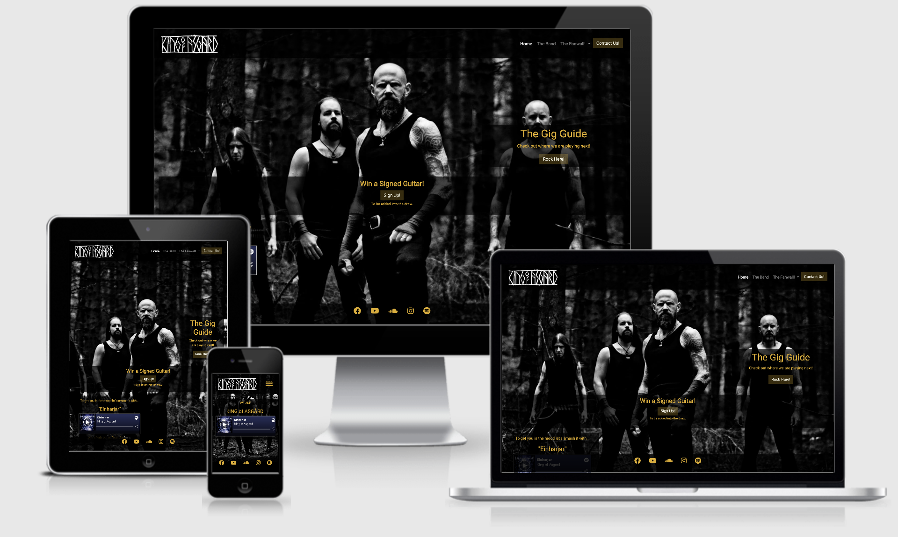

# King of Asgard 

This is essentially a website for a real nordic melodic death metal band in Sweden call "King of Asgård" - with a bit if a twist. Since most death metal bands are pretty much the same; why should someone listen to their music? What does their music give of value? What besides the music keeps their fans coming back?
In this case I try to answer that with a narrative or storyline of the King of Asgård that comes down and lands on earth to start a death Metal band. He meets the band members in a bar in a small Swedish Town. The site would also include a page called "The Fanwall", which would serve as a social media platform for fans of all kinds of metal music and also fantasy fans perhaps. 
The site would also incorporate a little humour so that it is all not too serious.

The story line would serve both fans of death metal (who would not necessily be fans of fantasy books )and fantasy fans (who would not necessrily be death metal fans). 
You can visit the deployed website [here](https://dsteyn44.github.io/kingsofasgard-ms1/).

#
 
## UX
 
### Strategy:

 Target market: 
 This website would generally serve fans death metal ansd eventually fantasy or norse mythology fans. The age range would be from 18 years of age to 99. All sexes and persons from cultural backgrounds would be welcome dependent on their tastes. 

#### Client Goals
- As a client I want to set-up a website so that it will bring like-minded people together.
- As a client I want a better platform so that I can increase my fan base.
- As a client I want my users to easily navigate my site so that they have a better user experience and therefore will continue to visit.
- As a client I want the website to have room to evolve so that I will have a repeat fanbase that is not necessarily in the same genre
- As a client I want eye catching visiuals so that the first time users will want to want to investigat further. 

#### First time User Stories
- As a first time User I want to be able to hear the bands music on the first page so that that I decide to follow.
- As a first time User I want to see where they are playing and the dates so I can see if I am  able to go view the concert.
- As a first time User I want to see what the band is about, who they are so I can decide this is something that i may like.
- As a first time User I want to navigate easily throughout the site so that I can get to the pages efficently. 

#### Frequent User
- As a frequent user I want updates so that I can visit the website and it will keep me interested.

#### Festival organiser/ Concert organiser
- As festival organiser/ Concert organiser I want to efficently contact them.
- As festival organiser/ Concert organiser I want to see who account for their fans  so that I can see if they are are suitable for the content that I provide.

#

## Features

I changed the features from the wireframes as they did not work very well with the responsiveness. Also I change the name of the gallery from "My Army" to "Skål" - which is more of a postive thank you to the fans. I left out the page for the narrative or storyline "The Legend" and just added it to the information about the band.

Header

- Band's name: Always on the left-hand side to get the users attention.
- Navigation Bar: Too include links to Home button, The Band page, The Fanwall (with a dropdown menuthat includes links to The Fanwall, ool Stuff and Skål! pages). It must also include a "Contact Us" modal to send simple information to the client. A hamburger styled toggle will be added for small screen sizes so that it will be easier to navigate.

The Footer 

- Links to social media platforms that are related to the product. Must be fixed and visible at all times so that the user can easily get to it. 

Front Page
- Background is menacing picture of the band . Has overflow to give a scroling effect.
- Gig-list includes a call-to-action pop-up modal that will lead the user to a gig-list where they can choose to click on that takes them to a page for purchase. Must be central on the page. Will be moved to icon for mobile devices. 
- Sign-up & win includes a call-to-action pop-up modal that will lead the user to a sign-up sheet. To make it more fun - it will include a question about the band so that the user will go band to the band page. Users can sign up and stand in line to win a guitar.
- A music snippet of the best song to entice peole to listen further and navigate the site. This should be on the lower left hand corner. Altogether all features on the front page will be at a postive gradient to instill a positive feel.

The Band Page
- Information about each band member.
-This will have a little narrative of how the band formed. In the future this will be converted into more of a graphic novel idea.   

The Fanwall
- the header must reflect the page where you are at ie. the color must be different anf the fanwall batton must be white to inform the user that they are here.
- Must have the latest song as a snippet. 
- Overall color must be different to front page so that you can distinguish the difference. 
- Must have a jumbotron with quotes from fans. There must also be a button to add a message to the band. In the future this will be immediate but for now it will be added by marketing.

Cool Stuff
- Must have merchandise for sale that fans can purchase through a click.
- Must be linked to the rest of the website.
- Must have prices on so users can see.
- This will evolve into a store.

Skål Page
- Essentially a gallery with pictures from the band, their travels and fans. 

Fail- page
- This page is to inform the user that they have reached an empass but will be able to safely get back to the home page. There will be a a slightly humourous message.

## Features Left to Implement
- More extensive story or narratiove page or graphic novel page. 
- Add bootstrap tooltips to Sign Up and Gig- lists and navbardrop-downs to give a bit of an explanation with out taking up too much real estate.
- Add a more extensive "twitter" like page, where fans can post.
- Must add music video to fanwall. 
- Cool stuff will eventually become a store.

### Structure:

- Must be able to go where you want to within 3 clicks.
- Utilize "hamburger" bar to allow for more real estate.
- Used more of a linear structure. 
- The use of media queries was used so to remove som eof the information that was probably not all that necessary. for small devices at first.

#

## Skeleton
The wireframes were designed using [Balsamiq](https://balsamiq.com/). 
   Desktop   |    Tablet    |    Mobile    |
|    :----:    |     :----:   |    :----:    |
|[Home Page](wireframes/desktop-home.png)|[Home Page](wireframes/tablet-home.png)|[Home Page](wireframes/mobile-home.png)|
|[The Fanwall Page](wireframes/desktop-fan-wall.png)|[The Fanwall Page](wireframes/tablet-fan-wall.png)|[The Fanwall Page](wireframes/mobile-fan-wall.png)|
|[Fail Page](wireframes/desktop-fail.png)|[Fail Page](wireframes/tablet-fail-page.png)|[Fail Page](wireframes/mobile-fail-page.png)|

#
## Surface

#### Colours

Front page
- Black -  rgba (0, 0, 0, 0.8) this is cliche but pretty much the standard bearer tone. I was using a grey prior but it was too light. For the header and footer I decided to go with with a more transparent overlay so atht athe user can see what is under as a hint.
- Yellow - rgba (224, 172, 26)- this was used for the main text on the front page, the social links, The choice of yellow was a little acccidental. I was using mainly ivory but that was a little too boring for my liking. This yelow is quite reminiscent of the feel of Star Wars. 
- Ivory - I wanted an off white but something warmer. This I thnk works well with the yellow.  

Fanwall page
- Lilac - rgb(135, 140, 175) This was a color on the spotify music audio bar and I used it so that there would be some correlation between the first page and the second.
- Ivory - Just to keep every thing consistent. 

Fail page
- Red - rgb( 231, 65, 24) general warning color and a good color to go with the black. 
- Black (0, 0, 0, 0.8)

#### Typography
- At first I was using Amatic SC with Roboto as second but then I noticed that Amatic was very thin and not easily noticible so I have just opted for Roboto. However in the future this may change for say Shatter for some of the head lines as it gives it a more dramatic effect.
I used a "Water" icon from Font Awesome; however I was actually aiming for something more nordic such as the symbol for Odin. This was a bit difficult to find and in the end I decided to stay with the same. 

#### Images
- Mostly black and white images were used so as to go with the theme of Nordic Noir. To give the feeling of a "murder novel". I tried to source the best images; however I was only able to obtain poor quality images for the mechandise on the "Cool Stuff" Page. 
 

## Technologies Used

- [HTML 5](https://en.wikipedia.org/wiki/HTML5) - Standard programing language.
- [CSS 3](https://en.wikipedia.org/wiki/Cascading_Style_Sheets) - Standard programing language.
- [BOOTSTRAP 4.1.3](https//bootstrrap.com)- Bootstrap is the most popular HTML, CSS, and JavaScript framework for developing responsive, mobile-first websites. This was used extenssively throughout the project for example the grid layout , navbar structures, dropdown menus, jumbotrons, modals, and dispay (media).
- [JAVASCRIPT](https://en.wikipedia.org/wiki/JavaScript) - Programming language that conforms to the ECMAScript specification. This was used for the modals in conjuction with Bootstrap.
- [GOOGLE FONTS](https://fonts.google.com/) - I added this the font that i used through out
- [FONT AWESOME](https://fontawesome.com/) - I used this for all my icons eg: social links etc. 
- [AFFINITY PHOTO](https://affinity.serif.com/en-us/) - This a helped me so some mock-ips and for the background images on the fail page.
- [GITHUB](https://gitpod.io/) - IDE (Integrated Development Environment).
- [GITPOD](github.com/) - The remote hosting platform.
- [MOUNTAIN GOAT](https://www.mountaingoatsoftware.com/) - This was used to understand user stories.
- PAGES - Apple generic word processing program/application.  
- [W3 SCHOOLS](https://www.w3schools.com/) - I Found this very useful for clarification of clearfix  and inline block. 
- [STACK OVERFLOW](https://stackoverflow.com/) - It is gennerally public platform, mainly used for coming up with scripte solutions. 
- [MDZN](https://developer.mozilla.org/) - Resource tool for developers, by developers. I used this to assist with resizing my images.
- [CHROME DEVELOPER TOOLS](https://developers.google.com/web/tools/chrome-devtools) - This was used to test out resposnsiveness and just for general trouble-shooting. Gives you real time feedback.
- [RESPONSIVE WEB DESIGN](http://ami.responsivedesign.is/) - I used this to add to my mock-up for my README.md.

#

## Testing

View the testing [here](Testing.md).

#
## Deployment

### This project is hosted in GitHub Pages

- On the menu on the top of the project’s repository on GitHub select Settings.
- Scroll down to the GitHub Pages section.
- Inside that section, click on the drop-down menu under Source and select Master Branch.
- The page refreshes automatically and the website is now deployed.
- The link to the webpage is just in the GitHub Pages section down below.
- Only one branch has been used for this project.

### To clone this project from GitHub:

- Under the repository’s name, click Clone or download.
- In the Clone with hTTPS section, copy the given URL.
- In your IDE of choice, open Git Bash.
- Change the current working directory to the location where you want the cloned directory to be made.
- Type git clone, and then paste the URL copied from GitHub.
- Press enter and the local clone will be created.
#
## Credits

### Content
- Most of the content I got I sourced from the band's Facebook Page.
- The rest of the written content I made up. 

### Media
- Images used in this site were obtained from either google or from the groups's page on facebook. I then modified some images in Affinity.
- The Front page image was taken by Henrik Stolt.
- The music was taken from Spotify as the band did not have any Mp3 copies of the music. 
- Some of the links point to [Wikipedia](https://en.wikipedia.org/wiki/King_of_Asgard).
- I added music video links to (Youtube] too.

### Acknowledgments
- Precious Ijege for the mentor guidance and support.
- The Code Institute tutor team, and specially Jo, for their help and patience.
- Henry Stolt
- Everyone on Slack especially the mini_feb_group for their support. Natalie, Omer, Bobby, Ashley, Maggie, Matthew Vanessa and Mo.
- Karl Beckman - who is the lead singer for the band.
- Ted Sjulmark - Guitar
- Jonas Albrektsson- Bass
- Mathias Westman - Drums
- My wife Sofia and children August and Adam.
#