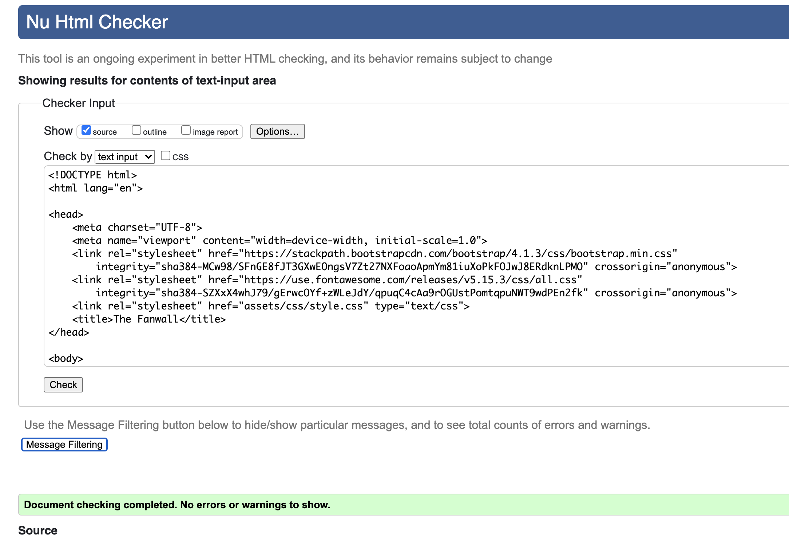
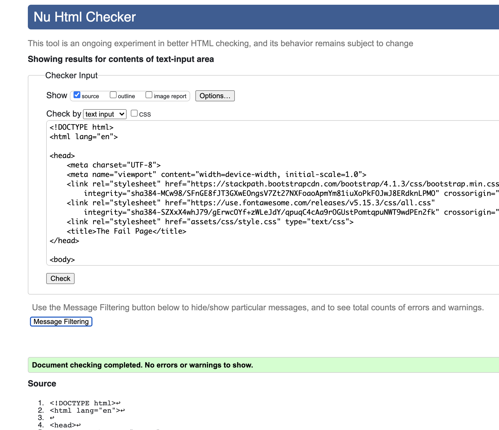
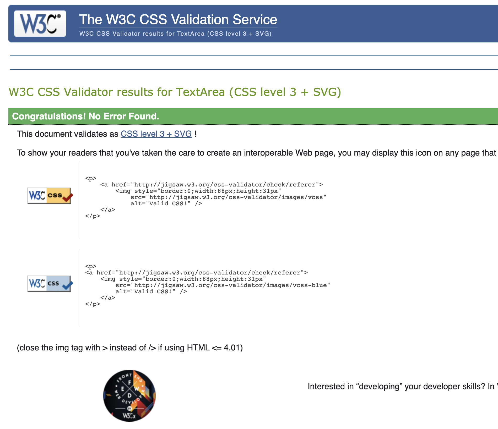
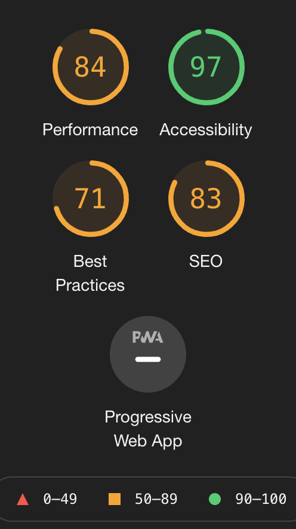
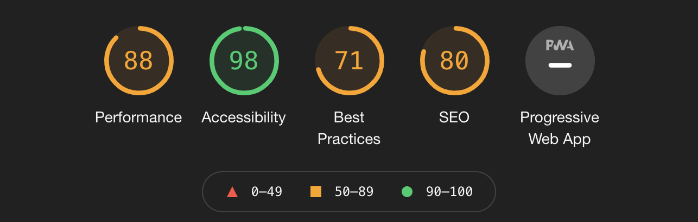
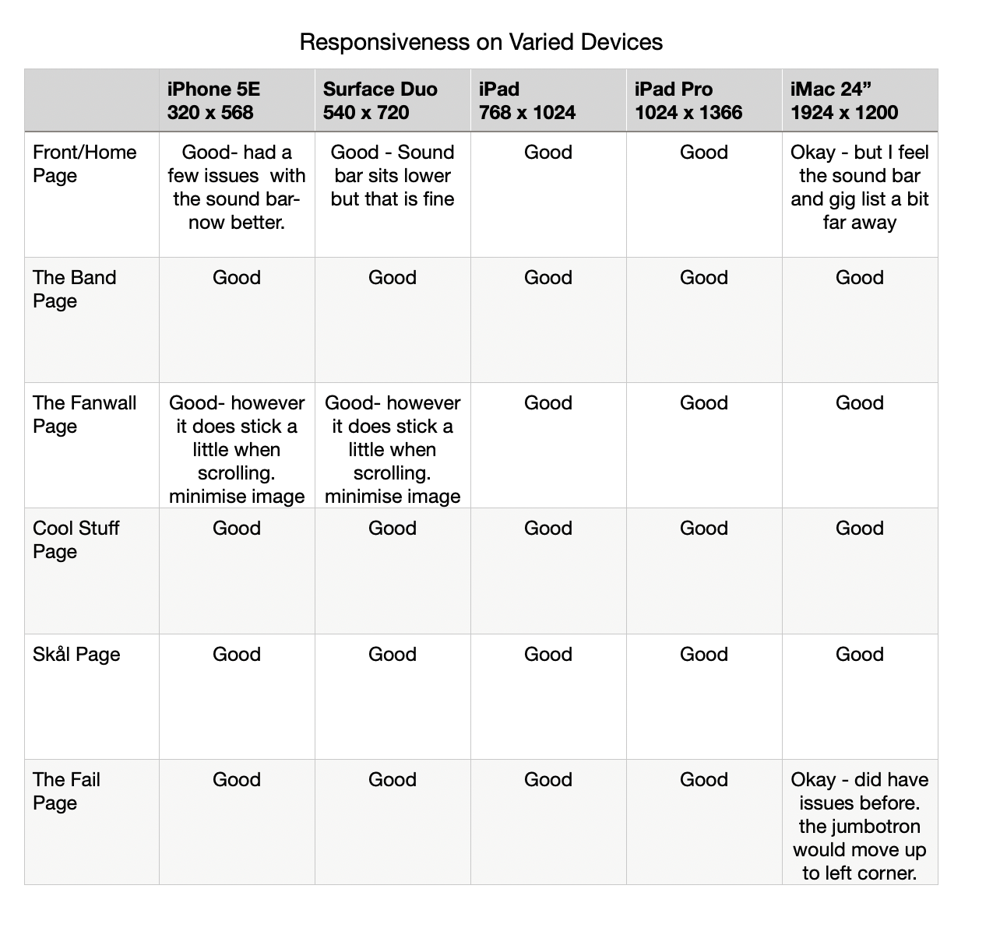

#  Testing Ground

## Overview
Generally, I tested my website as often as possible, and made it a regular habit to a) check my responsiveness on all devices, b) vallidating the script and c) beautify my script (on Mac SHIFT + Option + F). It was only then I would stage, commit and push. I also used repl.it to try pieces of code to assess whether it would work or not. I found this quite useful as it was quicker than gitpod and I could make mistakes without affecting my actual project. This did however take more time ( I mean the checking bit) and I think in the future, I will just have to plan better. Also I tended to get caught up in one bug and this wasted precious time. That is something for the future.  

The project was a little challenging in regards to working with Bootstrap. Bootstrap is certainly great tool for creating a structured template in place but admittedly I had challenges with the responsiveness and overiding its templates to suit my requirements. This is more attributed my inability to fully understand the scope of the software (and software platforms for that matter). So when I hit a snag it takes more time to figure out where the problem lies. Generally and as mentioned in the coursework, in order to overide bootstrap, you have to be fairly specific. This is a learning process. 
#
## Validators used: 
- Jigsaw - I used this for CSS verification. [Jigsaw validator](https://jigsaw.w3.org/).
- Nu W3 validator - I used this for HTML verification. [W3 validator](https://validator.w3.org/).
- Lighthouse - I used this to check performance. However I have to be honest and say that there was alot I was unsure of but it was good to gage and will be useful in the future. [Lighthouse Chrome](https://developers.google.com/) 

### Proof of final validation:

### HTML:
#### index.html 

#### fanwall.html 

#### fail.html 

### CSS:
#### style.css

### Lighthouse:
- Mobile

- Desktop

#
## Responsiveness

For the responsiveness I used Chrome Developer Tools to check how the website would behave. However saying this I must add that it did not always give a correct or real account on the device. Of course it is only a tool and not but I found one instance where it did not give me the correct response. This was an instance it was for mobile phone (iPhone X). On Dev tools it showed the main figure on the front-page was clearly visible but when I uploaded this on my device his head appeared cut-off by the jumbotron. The image looked too big. I did clear this up later by adding a media query and viewpoint height.  

I also used [Responsive Design Checker](www.responsivedesignchecker.com) and this was fairly accurate. The difference (niether good nor bad) this site has over Chrome Devoloper is that it has some sizes that Chrome does not such as the IMac Desktop 24". I us the 27" so when I opened my browser to Chrome it overstretched my image. Below is a responsiveness chart that shows the how each device responded. I added the surface duo because it has a perculiar screen so i can see how my site reacts. 

### Chrome
- This was very quick to load with little to no delayed surface loading. It also responds very smoothly, however the color is not as vivd as Mozilla Firefox. When submitting a modal it literally informs you with text. Not as subtle as Mozilla but better than IOS. 

### Mozilla Firefox
- No as quick loading as Chrome. Loading is sluggish ( I am sure this is probably my side and not from Mozilla's). However the color is definitley more vivid. The yellow on Firefox come off as more vivid and stronger than both Chrome and IOS. It is more noticible when you try a modal. If you attempt to submit without adding any informtion it just subtily informs you by showing a red border.It also has an application tha you can view your code and make changes. Very similar to that of Chrome Dev Tools and in fact psossibly more detailed than Chrome. Not as athaetically pleasing but it is more about performance. 

### IOS Mac
- Not the best to use for this website. It has no Dev Tools equivalent from what I can see and the color is not as bold. certainly not the most advanced of the three.  

#
## Bugs

Navigation bar
- Originally I wanted to have the band logo in the center of the page at the top; however it was not coorosponding with the other elemants on the navbar. I think this was due to the facrt that I tried to make a navbar by using columns. So instead I decided to just to use Bootstrap's template Nabvbar (with Navbar Brand) and this solved the issue. 

Gig Guide - front page
- For the Gig-list at first I wanted to add a dark drop-down menu. This did not sit right and i decided to go with a modal instead. When i tried to load the modal however it did not really work. Possibly it had an error in the code. I swopped the code for another - From the Whisky Project and customized to for my use. 
I grabbed another dropdown menu from another project.

Contact Us dropdown toggle
- I primarily had the Contact Us (Contact page) as a drop up page in the footer bar but when I made the screen smaller it would move above the social links. I was spending too much time trying to work this out so I opted to make it a drop-down in the navbar. I then noticed that in smaller sizes it would over expand the screen so you could not add any information or see the "submit button". I contacted tutor support and they suggested i go with a modal instead. It did solve the issue in a different way.

Front Page Spotify Sound control and Audio 
- One of the features of the website would be to have a clip of music on the front page. At first I was unable to obtain a audio clip from the band but instead I copied my own version of the song onto gitpod form iTunes. And although this worked at first it a) took up too much space and b) did not always play. So I then decided to use a clip from spotify. Even though this worked it was still a challenge to position the snippet to my requirements. 

Fanwall Page Spotify Sound control and Audio
- This was moving towards the right-hand side of the screen - particularly in mobile view. So I sourced an answer from stackoverflow and took the following script. 

 #audio-quote iframe {
    display: block;
    margin-left: auto;
    margin-right: auto;
    width: 50%;
}.
#

## User stories

### Client User GOALS
#### As a client I want set-up a website so that it will bring like-minded people together.
- The client in this case does not have a website but a page on facebook and although it is a place where fans can converse in one that will be solely dedicated to the band's fans. But the fact that it can evolve means that it may get bigger and become a bigger social platform. from my research there is not much out there.
#### As a client I want a better platform so that I can increase my fan base.
- Leading from the above, if you have a hub for this type of culture you will attract more, especially if they go with a narrative. 
#### As a client I want my users to easily navigate my site so that they have a better user experience and therefore will continue to visit.
- the website was designed to be easily navigated, that is mostly linear with a one branch. But it has scope that in the future it can evolve with more branches but it will always retain the ability to quickly get to where you want to go. even if you need to get out of an empass.
#### As a client I want the website to have room to evolve so that I will have a repeat fanbase that is not necessarily from the same genre.
- As discusssed above, having a narrative will bring in another crowd that is not necessarily death-metal fans. Also with the inclusion of humour (although you have to be careful), you will get fans who value the comedic value to. It shows that the band do not take themselves too seriously. 
#### As a client I want eye catching visiuals so that the first time users will want to want to investigate further. 
- The front page's Image does just that. It gets the attention of the user. It is more in line with a Nordic Noir theme- something you would see from the cover of a book and therefore is the reason i used it. I also used yello to catch the attention away from the black color. I also included a competition draw to attract fans. This draws them inside the website and a question about one of the band members leads the fans to scope out the band and their history, their narrative.

### First time User Stories
#### As a first time User I want to be able to hear the bands music on the first page so that that I decide to follow.
- This is the reason why I placed the sound bar. It is not on auto-play (I doubt anyone would continue to view the site if it was not). It is only a snippet so just enough to wet the appetite of the fan. Also I placed their best song so that it grabs a would-be fan straight away.
#### As a first time User I want to see where they are playing and the dates so I can see if i am  able to go view the concert.
- I placed the gig guide right and center so that it is easy to access 
#### As a first time User I want to see what the band is about, who they are so.
- The first time user can access this from the navbar or by simply scrolling down. there is also a competition that leads the user to sign up as part of the fan base and even before that, it will ask a question about a band member. this leads the user to look for the band memebr and acquire that information.
#### As a first time User I want to navigate easily throughout the site so that I can get to the pages efficently. 
- It is not a big sight at the moment, however thge links are easily accessed. 

### Frequent User
#### As a frequent user I want updates so that I can visit the website and it will keep me interested.
- This is the reason I added the fanmail, section. To make it easier for fans to be heard and see what aother fans are saying. It keeps the fans coming back. Also another reason for keeping the interest of the frequent fan is to keep the narrative going. So each new album that comes out will be a story (about the band essentially). It means also that the band does not run out of ideas.

### Festival organiser/ Concert organiser
#### As festival organiser/ Concert organiser I want to efficently contact them.
-There is also a Contact Us! modal at the top of the page visible at all times.
#### As festival organiser/ Concert organiser I want to see who account for their fans  so that i can see if they are are suitable for the content that I provide.
- As a Concert agent they can gage the newer fans and the frenquent fans by visiting the Fanwall. It will be up to date with what the band is doing. 
#

## Side Notes

### - These are a few of my notes that i took while coding. I ran a little out of time near the end so some do not reflext the final changes. 
[Side Notes](readme-files/ms-1-list.pdf) [original front page]